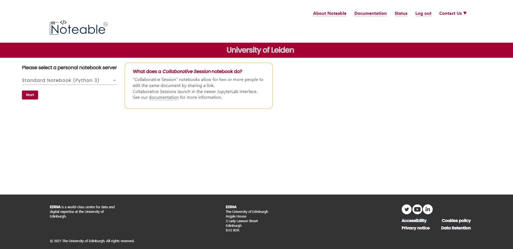
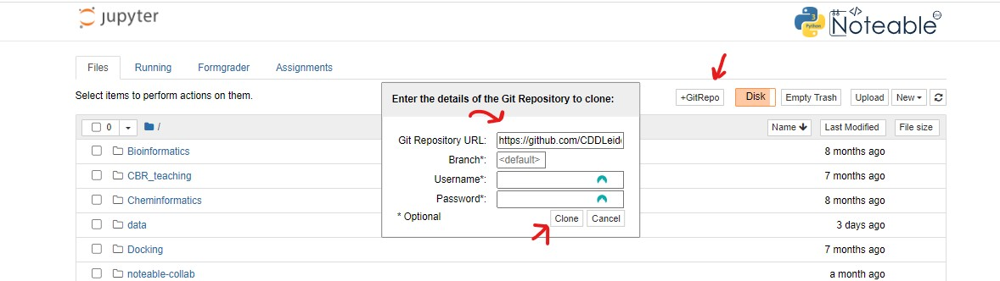

# ULLA 2023 QSAR modelling Workshop
Welcome to the ULLA 2023 workshop in Leiden. This repository contains the materials for the workshop.

## Noteable set-up

First follow the link to noteable on brighspace, if you have not done so yet.
Select the `Standard Notebook (Python 3) option` and click the start button. This will start the notebook server.

Then click on the `+GitRepo` button to clone this repository.
In the `Git Repository URL` field, paste the following link: https://github.com/CDDLeiden/ULLA2023_Workshop-Leiden.git
Then click the `Clone` button, you don't need to add a username or password.

Now you should see the repository in the file browser. Click on the `ULLA2023_Workshop-Leiden.git` folder and then on the `QSAR_modelling.ipynb` file to start the practical.
Have fun!

